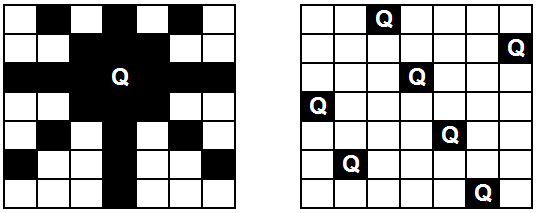

# Algoritmos Gulosos

## Problema do Troco

Suponha que tenhamos disponíveis moedas com certos valores (por exemplo, de 100, 25, 10, 5 e 1). O problema do
troco consiste criar um algoritmo que para conseguir obter um determinado valor com o menor número de moedas ´
possível.
Por exemplo, para “dar um troco” de R$2,89, a melhor solução, isto é, o menor número de 
moedas possível para obter o valor consiste em 10 moedas: 2 de valor 100, 3 de valor 25, 1 de valor 10
e 4 de valor 1.

1) **Objetivo:** contrua um algorítmo que recebe a lista das moedas disponíveis e um valor, e retorna uma lista com a menor
quantidade de moedas para este troco;
  * Defina uma assinatura adequada para este método;
  * Utiliza uma abordagem gulosa (se puder);
  * Contabilize e exiba o número de iterações para cada caso de teste;
  * O exercício pode ser feito em grupos de um, dois ou três elementos.

## Escalonamento de Intervalos

### O Problema

Um *intervalo* é um conjunto de números naturais consecutivos.  Um intervalo como  *{s,s+1,…,f−1,f}*  será denotado por  *(s,f)*. O primeiro número do par é o início do intervalo e o segundo é o término.  (As letras *s* e *f* lembram *start* e *finish* respectivamente.)

Se temos vários intervalos, numerados de 1 a n, o início de um intervalo *i* será denotado por *s<sub>i</sub>* e o término por *f<sub>i</sub>*.  Suporemos sempre que *s<sub>i</sub> ≤ f<sub>i</sub>*.

Um intervalo i é anterior a um intervalo j se  *f<sub>i</sub> < s<sub>j</sub>*.  Analogamente, i é posterior a j se  *s<sub>i</sub> > f<sub>j</sub>*.   Dois intervalos i e j são disjuntos se e somente se i é posterior a j ou anterior a j.   Uma coleção de intervalos é disjunta se os intervalos da coleção são disjuntos dois a dois.

### Problema do escalonamento de intervalos

Dada uma coleção S de intervalos, encontrar uma subcoleção disjunta máxima de S.

Uma subcoleção disjunta X de S é *máxima* se não existe outra maior.  Em outras palavras, se não existe subcoleção disjunta *X′* de *S* tal que *|X′| > |X|*.

Usaremos a abreviatura *SDM* para a expressão subcoleção disjunta máxima.  Nosso problema consiste, portanto, em encontrar uma *SDM* de uma coleção de intervalos dada.  Se os intervalos são numerados de 1 a n, uma *SDM* pode ser representada por um subconjunto de * *{1,2,…,n}*.

**Exemplo** 
A figura abaixo especifica uma coleção de intervalos e uma sdm da coleção.  A SDM é indicada pelos 1 do seu vetor característico X:

```javascript
s 4 6 13 4 2 6 7  9  1 3  9
f 8 7 14 5 4 9 10 11 6 13 12
X 0 1 1  0 1 0 0  1  0 0  0
```

É fácil verificar que a coleção de 4 intervalos definida por x é disjunta. Mas não é óbvio que ela seja máxima. Você tem certeza de que não existem 5 intervalos disjuntos dois a dois?

### Algoritmo guloso

Nosso problema pode ser resolvido por um algoritmo guloso. Para descrever o algoritmo, precisamos do seguinte conceito. Digamos que o primeiro intervalo de um coleção de intervalos é o que tem o menor término.

Eis o esboço do algoritmo guloso. Ele recebe uma coleção S de intervalos e devolve uma sdm de S:

```javascript
X ← { }
enquanto S ≠ { } faça
   i ← primeiro intervalo de S
   X ← X ∪ {i}
   S ← coleção dos intervalos posteriores a i
devolva X
```

Antes de transformar esse esboço em pseudocódigo de nível mais baixo, convém exigir que os intervalos estejam em ordem crescente de término (Com isso, o primeiro intervalo é o de índice 1).

O algoritmo supõe f<sub>1</sub> ≤ … ≤ f<sub>n</sub> e n ≥ 0 e devolve uma sdm da coleção de intervalos definida por *(s,f,n)*:

```javascript
SDM-Guloso (s, f, n)
1   X ← { }
2   i ← 1
3   enquanto i ≤ n faça
4        X ← X ∪ {i}
5        k ← i + 1
6        enqunto k ≤ n e sk < fi faça
7              k ← k + 1
8        i ← k
9   devolva X
```

O código pode ser reescrito de maneira mais elegante:

```javascript
SDM-Guloso (s, f, n)
1   f0 ← −∞
2   X ← { }
3   i ← 0
4   para k ← 1 até n faça
5         se sk > fi
6              então X ← X ∪ {k}
7                       i ← k
8   devolva X
```

2) **Assim:**

* Implemente e teste uma solução para o problema descrito, usando aboradagem gulosa, como descrita;
* Contabilize e exiba o número de iterações para cada caso de teste;
* O exercício pode ser feito em grupos de um, dois ou três elementos.

# Problema das n-rainhas

## O problema

O problema das N-rainhas consiste em encontrar uma combinação possível de N rainhas num tabuleiro de dimensão N por N tal que nenhuma das rainhas ataque qualquer outra. Duas rainhas atacam-se uma à outra quando estão na mesma linha, na mesma coluna ou na mesma diagonal do tabuleiro. Na figura que se segue pode ver-se as posições atacadas por uma rainha colocada num tabuleiro de dimensão 7 por 7 e ao lado uma possível solução para esse mesmo tabuleiro.



1. Desenvolver uma aplicação que resolva o problema das n-rainhas, encontrando uma solução válida para o problema. Como entrada, o programa recebe um valor para n >= 2, e retorna a disposição das rainhas no tabuleiro. Utilize uma estratégia de backtracking.

1. Ajuste o algoritmo anterior, para que retorne todas as soluções possíveis.
